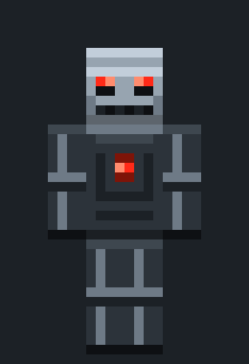
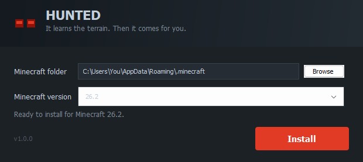

# Hunted

A Minecraft mob that actually hunts you. Ten hearts, player walking speed, no
free gear, and one advantage: it always knows where you are. It reads the
terrain, tunnels through what is in the way, bridges gaps it cannot jump, and
fights like someone who has played the game before. It starts with nothing and
mines its own iron first.

<p align="center">
  
</p>

Fabric mod for Minecraft 26.2. Install it by downloading one file and clicking
one button.

## Install

**Close the Minecraft launcher first.** It rewrites its own settings file when
it exits, which would undo the install and take the Hunted profile with it.

Download `hunted-installer.jar` from
[Releases](https://github.com/TiltedLunar123/Hunted/releases) and double click
it. If your system opens it in an archive tool instead, or nothing happens, run
it from a terminal:

```bash
java -jar hunted-installer.jar
```

Then press Install.

<p align="center">
  
</p>

It finds Minecraft on its own, registers a Fabric version with the official
launcher, downloads Fabric API, and puts the mod in place. Then open the
Minecraft launcher and pick the **Hunted** profile.

The install is self contained. It uses its own game directory inside your
Minecraft folder (`hunted`), so it cannot disturb an existing modded setup, and
it copies `launcher_profiles.json` to `launcher_profiles.json.hunted-backup`
before touching it. That copy is written once and never overwritten, so it stays
the pre-Hunted original however many times you reinstall. Removing Hunted is
deleting one folder and one profile.

The installer looks for Minecraft in the usual place for your system, including
Flatpak and Snap on Linux. It needs to find `launcher_profiles.json`, which the
official launcher writes the first time it runs, so **launch vanilla Minecraft
once before installing** if this machine has never run it. Otherwise use Browse
and point at the folder yourself.

No system Java? The installer needs any Java 17 or newer to run. The game itself
uses the runtime the Minecraft launcher installs for you.

### On a server

The installer only handles the official launcher. For a dedicated server,
install Fabric on it as normal and drop `hunted-<version>-mc26.2.jar` and the
matching Fabric API jar into the server's `mods` folder.

Every player who connects needs the mod as well. It registers a new entity, and
a client that does not know about it cannot join. Hunted is not a server-only
mod.

Then, in game:

```
/hunted spawn
```

## It does not cheat

The default tier is **Rival**, and a Rival has exactly what you have:

| | Rival | You |
| --- | --- | --- |
| Health | 20 | 20 |
| Movement speed | 0.1 | 0.1 |
| Base attack damage | 1, plus the weapon | 1, plus the weapon |
| Step height | 0.6 | 0.6 |
| Healing | from food it went and got | from food you went and got |
| Mining speed | whatever the tool allows | whatever the tool allows |
| Starting equipment | none | none |
| Blocks to build with | only what it mined | only what you mined |
| Swimming | slower than walking | slower than walking |
| Getting hit | knocked back, briefly off balance | knocked back, briefly off balance |
| Dying | back at world spawn with nothing | back at your spawn with nothing |
| **Knowledge of you** | **your position, always** | **whatever you can see** |

Every physical number is a player's. The last row is not, and that is on
purpose: it is the compass every manhunt runner has always been chased by. A
hunter that could genuinely lose you spent most of its time standing in a field
having lost you, which is not a game. This one knows where you are and still has
to walk there, through whatever is in the way, carrying gear it went and mined.

Sixty health and a speed boost would be tedious. Knowing where you are is not
tedious, it is the premise.

If you want one that can be given the slip, **Scout** and **Stalker** work only
from what they can see and hear.

Two tiers sit **below** a player and are handicapped rather than boosted. Two
sit above and are openly unfair, which is the reason they are not the default.

## What it does

**It pathfinds properly.** Minecraft's built in navigation gives up at 32 blocks
and refuses to touch the terrain, which rules out everything interesting. This
runs its own A* search over block positions where mining, bridging and jumping
all have a cost in ticks. That means it can genuinely weigh tunnelling through a
hill against walking around it, and pick the faster one.

The search runs in slices across ticks rather than all at once, and always hands
back the best route it found so far. A hunter that walks most of the way and
re-plans beats one that stands still waiting for a perfect answer.

**It cuts you off.** Steering at where someone now is produces the tail
chase that gives every pursuit mob away, sitting behind you at a fixed distance
and never closing, because it is forever aiming at where you just were. This
solves for where the two of you would actually meet and runs there instead.

It only leads you while you have been moving predictably. Strafe about in a
doorway and it stops trying, because leading a target who is jinking just sends
it confidently past you.

**Parkour.** A three block gap is a running jump, four if it lands lower.
Anything wider it walks around, because a jump it cannot land is just a hunter
at the bottom of a ravine.

**Bridging.** Over anything it cannot jump, it builds. The naive way to do that
is place a block, step on it, repeat, which stutters at every edge and walks
into holes on any tick where placement fails. This keeps the ground ahead of
itself instead: it will not advance onto a block with nothing underneath, and it
places the support for the step after next while it is still walking. It also
throws a block under its own feet on the way down if it ever ends up falling.

**Real melee.** It hops before swinging so the hit lands as a critical, and it
waits the full 13 tick cooldown instead of flailing. It circle strafes rather
than charging in a straight line. It raises a shield between swings, and breaks
yours with an axe.

**It starts from nothing.** On by default, because handing it free diamond gear
is a cheat like any other. It chops wood, crafts a pickaxe, mines stone, digs
for iron at Y 16, smelts it, and builds an iron sword and shield before it comes
looking for you. Watching it fell its first tree while you sprint in the other
direction is a very different feeling from a geared mob spawning behind you.

It builds with what it mined, too. A hunter that has not found stone genuinely
cannot bridge.

**It clutches.** Three iron buys a bucket, and it will go and fill it. After
that, any drop it can see the bottom of stops being a wall and becomes a
shortcut: it steps off, puts the water down in the last few blocks, lands in it,
and picks the bucket back up. The pathfinder knows it can do this, so a hunter
carrying water takes routes down ravines that a hunter without one refuses.

Worth being precise about why it is water and not blocks. Fall damage is
calculated from the total distance fallen, so placing a block under yourself
part way down saves you the height of that block and nothing else. Water zeroes
the whole thing.

**It eats.** Healing comes from food, the way it does for you, and it will go
and get some. It hunts animals, and if it has flint and steel it sets them on
fire first, because something that dies burning drops its meat already cooked
and that skips the furnace entirely. Otherwise it cooks the meat itself, in a
smoker if it has built one, since a smoker is twice as fast. A hay bale it walks
past becomes nine wheat and three loaves.

It only stops to eat when nothing has hit it for ten seconds, so you cannot
watch it heal in the middle of a fight.

**It loots.** Any chest, barrel or dispenser it walks past gets opened, and it
takes what it has a use for and leaves the rest. Finding a village chest skips
most of the ladder, which is exactly what it does for a player.

**It follows you.** Through doors, across water, up ladders, and into the Nether.
The upper tiers do not lose the trail.

## How it decides

Every tick it looks at you and scores what it sees: your armour, what is in your
hands, whether you have a shield, and, if the tier is good enough to tell, how
hurt you are. It scores its own equipment the same way. The difference between
those two numbers drives almost everything.

A handful of cases override the comparison, and those are the ones you notice.

- You are unarmed and unarmoured, so it attacks regardless of what it is
  carrying. Nothing it could go and craft beats hitting someone who cannot hit
  back.
- You are nearly dead, so it commits and stops caring about its own health.
  Letting you get away and eat is the only way it loses from there.
- You are eating, mid swing on a block, falling, or facing the wrong way. That
  is a window, and if it is close enough to reach you before the window shuts,
  it drops everything and sprints.
- You have a shield and it does not have an axe, so it goes and makes one.
- It is losing the exchange but not dying, so it stops trading. Shield up, sits
  just outside your reach, and only counters after you have swung, when your
  sword is still recharging and the hit is free.
- It is about to die, so it turns and runs at full speed, throwing a wall up
  behind itself to break line of sight. It eats once nothing has touched it for
  ten seconds, heals off the food, then comes back.

That last one works off the rate it is losing health, not a flat percentage. A
hunter on half health taking netherite crits has already left. One on two hearts
that nothing has touched in a while keeps coming.

### With more than one of you

It scores everyone and takes the softest target, not the nearest, so it will
walk past someone in full iron to reach whoever is unarmoured at the bottom of a
cave.

It also counts how many of you are standing together. A player with two armed
friends next to them is a much worse target than the same player alone, because
attacking them starts a three on one. So it works the edges of a group and takes
stragglers rather than charging the middle.

Once committed it stays committed. A target has to be clearly better before it
turns around, otherwise it would spend the whole game changing its mind.

`/hunted status` prints the current decision and the reason for it, so when it
does something that looks wrong you can see what it thought it was doing:

```
Rival in overworld at 118 63 -204, 20/20 hp, gathering oak_log, 12 broken, 0 placed
    counter_shield: they have a shield, going to make an axe
```

## It talks

On by default. The hunter tells you what it is doing, in chat, in a flat voice
that never raises itself:

```
[Hunter] I have your location.
[Hunter] Iron becomes a problem for you.
[Hunter] There you are.
[Hunter] Your guard thins.
```

It speaks when its plan changes rather than on a timer, with a hard floor of
eight seconds between lines and an ambient line only after forty seconds of
silence. A quiet chase stays mostly quiet, which is what makes the lines land
when they do come.

Turn it off with `/hunted taunts false`.

## Tiers

The tier decides how good its information about you is, which matters more than
its stats. The default knows your position outright, so it can be outrun but not
hidden from. The two below it have to find you, which makes them slower and much
easier to shake.

Health is in half hearts, the same number the game shows you. Speed is the
walking speed attribute, where yours is 0.1.

| Tier | Health | Speed | Terrain | Knowledge | Fair |
| --- | --- | --- | --- | --- | --- |
| Scout | 20 | 0.085, slower than you | none | sees and hears you | yes |
| Stalker | 20 | 0.095, slightly slower | breaks blocks | sees and hears you | yes |
| **Rival** | **20** | **0.1, yours exactly** | **mines and bridges** | **always knows** | **yes on stats, the default** |
| Enforcer | 30 | 0.13, your sprint while walking | mines and bridges | fixes your position every 3s | no |
| Relentless | 40 | 0.16, faster than you can sprint | mines and bridges | always knows, everywhere | no |

Breaking line of sight works against Scout and Stalker, because they only know
what they can perceive. Rival and above always know, so hiding buys you nothing
and distance is the only thing that does.

Against the two that can lose you, losing them is not the same as being rid of
them. After about a minute without seeing or hearing you they stop believing
their information, walk to wherever they last had you, and sweep the area in
widening arcs. You have to leave, not just hide.

## Commands

```
/hunted spawn [tier] [player] [survival]
/hunted clear
/hunted status
/hunted tier <tier>
/hunted survival <true|false>
/hunted taunts <true|false>
/hunted respawn <true|false>
/hunted terrain <true|false>
/hunted dimensions <true|false>
/hunted glow <true|false>
/hunted distance <8-256>
```

Full descriptions are in [docs/COMMANDS.md](docs/COMMANDS.md).

Everything is also in `config/hunted.json`, and the mod respects the vanilla
`mobGriefing` game rule, so a server that has already said mobs do not touch its
builds does not have to say it twice.

## Building

Needs JDK 25, because Minecraft 26.2 does.

```
./gradlew build
```

The mod lands in `mod/build/libs` and the installer, with the mod bundled inside
it, in `launcher/build/libs`.

To build against a different Minecraft version, change `minecraft_version` and
`fabric_api_version` in `gradle.properties`. See
[docs/COMPATIBILITY.md](docs/COMPATIBILITY.md) for what works and what does not.

## Status

It compiles clean with no warnings, and 88 tests cover the pathfinder, the
interception maths, the tactics, the crafting ladder and the installer,
including a full install run against a local server.

None of that is the reason to trust it. It has been run on a real Minecraft 26.2
dedicated server and watched hunting a real player, which is. The unit tests were
all green while the hunter was, in a running game, completely unable to move:
vanilla resets a mob's movement input immediately after the hook this mod runs
in, and nothing that tests a pathfinder in isolation will ever notice that. Every
serious fault found so far has been of that kind, living in the seam between the
mod and the game rather than inside any one piece.

Verified in a running game: killing it and having it walk back from world spawn
with nothing, breaking off from a fight it is losing and staying broken off
rather than turning round every second, going and finding a weapon when it has
none rather than throwing punches, being knocked about properly when hit,
swimming slower than the person it is chasing, spawning and persistence across a
restart, chasing
across open ground and around walls, tunnelling through a wall, bridging a gap,
towering up an eight, twelve and twenty block pillar and killing the player at
the top, digging into a sealed stone room, the crafting ladder from an empty pack
through planks, a table, sticks and a wooden pickaxe to mining stone, emptying a
chest and crafting an axe out of what it found, smelting a run of iron without
being interrupted, the water bucket clutch surviving a forty block drop and
picking the bucket back up, following a player through a nether portal, eating to
heal, fighting mobs, breaking off when hurt and walling itself in, searching
after losing the trail, giving up on gathering and coming for you when the
shopping stops paying, switching to a wounded player mid chase, the taunt lines,
and killing the player. All five tiers were checked against the two obstacles
that separate them: only the tiers that mine get into a sealed room, and only the
tiers that build get up a pillar.

Seen on screen in a real client rather than only in a server log: the model and
skin, the dark red name tag, the outline through walls, and the taunts arriving
in chat.

Measured rather than guessed at, on a flat world with a stopwatch: it travels at
6.3 blocks a second, against 5.6 for plain sprinting, because it sprint jumps the
way people do rather than simply running. It crosses deep water at about 1.5,
against roughly 2 for someone swimming. Hit while it is charging you it gives up
a block of ground, where before it gave up a third of one and kept coming.

Still not verified in a running game: the smoker, crafting and filling the water
bucket rather than being handed one, and the flint and steel and hay bale food
paths. Those are covered by unit tests and by reading, which the paragraph above
should tell you is not the same thing.

Longer sessions will find more. If something behaves badly in practice, an issue
with the tier and what you were doing is genuinely useful.

### What it does not do

Worth saying plainly, so nothing here is a surprise.

- **It cannot build a nether portal.** It will walk into one that already exists
  and follow you through, and the top two tiers cross without one, but it has no
  way to make obsidian.
- **No end portal, ender pearls or blaze rods.** Go to the End and you have lost
  it, unless you are being chased by a Relentless.
- **It will not go diamond mining.** It makes diamond gear out of diamonds it
  finds in a chest or tunnels into on the way to iron, and it never goes looking
  for more. It also only stops to make them when it has decided it is behind on
  gear, so out-diamonding it is what triggers the upgrade.
- **It will not dig gravel hoping for flint.** The flint and steel trick needs
  flint it already picked up.
- **It is not a good pathfinder over long open distances yet.** It crosses ground
  fine, but given a goal tens of blocks away with nothing in the way it can drift
  rather than commit, and take longer than it should to arrive.
- **A hunter in unloaded chunks is a hunter that is not thinking.** That is how
  Minecraft works and this mod does not change it. Walk far enough away in single
  player and the one behind you stops where it stands until you come back. On a
  server with other people about, someone else usually keeps it awake.
- **It does not fight everything.** It kills what is hitting it or standing in
  the doorway, backs off from creepers and wardens, and walks past the rest.
- **Killing it is not the end of it.** It comes back at the world spawn with an
  empty pack and walks. That is the same deal you get, and it is the point. Turn
  it off with `/hunted respawn false` if you would rather beat it once.
- **It gives no experience for a replacement.** Only the first one is worth
  anything, because a thing that comes back on a timer is otherwise a farm you
  stand next to rather than something hunting you.

## Credits

The idea comes from the Minecraft manhunt videos where a bot chases a
speedrunner, and the approach to pathfinding comes from
[Baritone](https://github.com/cabaletta/baritone), which worked out that
movement costs measured in ticks are what let a search compare digging with
walking.

No Baritone code is used here. Baritone drives a real Minecraft client, which
needs a second account and a second running game. This is an entity that lives
on the server instead, so there is no second account and nothing to pilot. It
does still have to be installed on every client, because a client that has
never heard of the hunter cannot join a server that has one.

## License

MIT. See [LICENSE](LICENSE).
